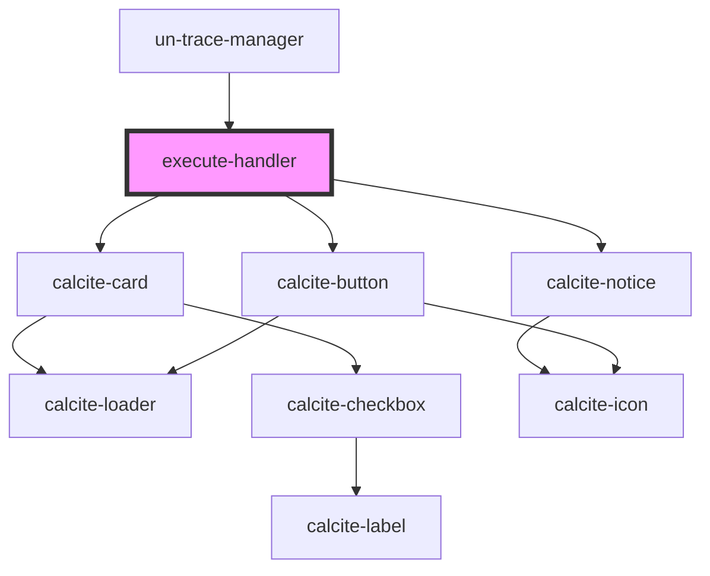

# execute-handler

<!-- Auto Generated Below -->

## Dependencies

### Used by

 - [un-trace-manager](..)

### Depends on

- calcite-card
- calcite-notice
- calcite-button

### Graph

----------------------------------------------

*Built with [StencilJS](https://stenciljs.com/)*
