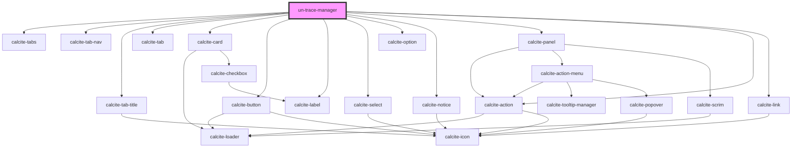

# my-component

<!-- Auto Generated Below -->

## Properties

| Property           | Attribute             | Description | Type      | Default                    |
| ------------------ | --------------------- | ----------- | --------- | -------------------------- |
| `appToken`         | `app-token`           |             | `string`  | `""`                       |
| `gdbVersion`       | `gdb-version`         |             | `string`  | `"sde.DEFAULT"`            |
| `host`             | `host`                |             | `string`  | `""`                       |
| `inAssets`         | `in-assets`           |             | `any`     | `undefined`                |
| `inTC`             | `in-t-c`              |             | `any`     | `{tc:{}, action:"update"}` |
| `isBasic`          | `is-basic`            |             | `boolean` | `true`                     |
| `localeDisplay`    | `locale-display`      |             | `string`  | `'ltr'`                    |
| `localeStrings`    | `locale-strings`      |             | `any`     | `undefined`                |
| `name`             | `name`                |             | `string`  | `""`                       |
| `runIsoTraceTwice` | `run-iso-trace-twice` |             | `boolean` | `true`                     |
| `showTerminals`    | `show-terminals`      |             | `boolean` | `undefined`                |

## Events

| Event               | Description | Type               |
| ------------------- | ----------- | ------------------ |
| `emitDrawComplete`  |             | `CustomEvent<any>` |
| `emitFlagChange`    |             | `CustomEvent<any>` |
| `emitQueryTrace`    |             | `CustomEvent<any>` |
| `emitSelectedTrace` |             | `CustomEvent<any>` |
| `emitTraceResults`  |             | `CustomEvent<any>` |

## Dependencies

### Depends on

- calcite-tabs
- calcite-tab-nav
- calcite-tab-title
- calcite-tab
- calcite-card
- calcite-button
- calcite-label
- calcite-select
- calcite-option
- calcite-notice
- calcite-panel
- calcite-action
- calcite-link

### Graph

----------------------------------------------

*Built with [StencilJS](https://stenciljs.com/)*
